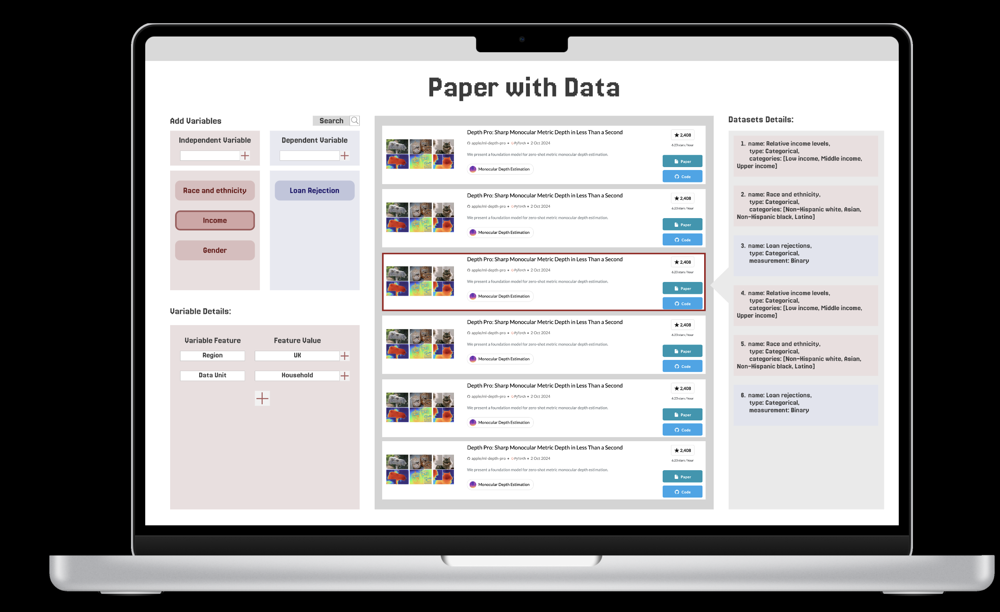

# AC215-Paper-with-Data

## Project Overview

This project aims to develop a machine learning pipeline that processes social science research papers to extract key features such as dependent variables, independent variables, and databases used. The pipeline is built using **Retrieval-Augmented Generation (RAG)** models to automate the extraction process from a large dataset of papers. The project utilizes **Google Cloud Storage** for data storage and **ChromaDB** for vector database management.

## Key Features

- **Data Processing**: Automatically load PDF files from Google Cloud Storage, structured by journal name. Segment text data into appropriate chunks for further processing.
- **Feature Extraction**: Utilize a RAG model to retrieve relevant segments of text and generate extracted features.
- **Containerized Deployment**: Deploy the entire pipeline using Docker, ensuring easy setup and consistency across environments.

## Mock Submission
This is a demo of our expected product. Our product is essentially a search engine tailored for academic purposes.




## Installation

### Prerequisites

1. **Python 3.8+**
2. **Google Cloud SDK**: Set up Google Cloud credentials for accessing the storage.
3. **Docker**: Ensure Docker is installed and running for containerized deployment.

### Python Dependencies

Install required dependencies using `pip`:

```bash
pip install google-cloud-storage transformers chromadb faiss-cpu PyPDF2
