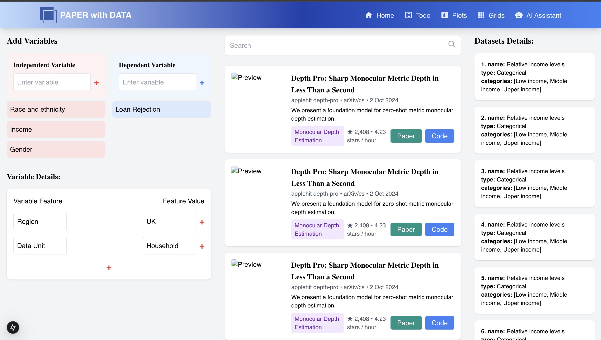

# AC215 - Milestone4 - Paper with Data


**Team Members**

Jinghan HUANG, Zhiyu LI, Haozhuo YANG, Luozhong ZHOU

**Group Name**

Paper with Data

**Project**

In this project, we aim create a dataset-centered search portal. This portal will enable researchers to use fine-grained dataset catefories and filter papers not just based on the presence of datasets, but also on the nature of their relationships. The core of our project is to construct a database of summarise of dataset from which we can get the most relevant papers to the query by users. We first use Gemini to construct a database and then use RAG to facilitate the searching process.

### Prerequisites
---

Before you begin, ensure you have the following installed and configured:

**Docker Engine**

Install Docker if not already installed.
Verify the installation by running:

```
docker --version
```

**A Google Cloud Platform account with appropriate permissions.**

Required actions include:
1. Get secrets from service account. You should give the following roles:
  * Compute Admin
  * Compute OS Login
  * Container Registry Service Agent
  * Kubernetes Engine Admin
  * Service Account User
  * Storage Admin
2. Enable relevant APIs.
  * Compute Engine API
  * Service Usage API
  * Cloud Resource Manager API
  * Google Container Registry API

Ensure your GCP credentials are stored securely. You can download the service account key file from your GCP console.

## Setup Instructions
---

Clone the repository:
```
git clone https://github.com/Themothalex/AC215-Paper-with-Data.git
```

Create a folder called `secrets`.
```
mkdir secrets
```

Rename you secrets into `deployment.json` and put it into `./mkdir/`

Build the Docker image:

bash
Copy code
docker build -t yourproject-image .
Deployment Instructions
To deploy the project using Docker:

Start the Docker container:

bash
Copy code
docker run -d \
  -e GOOGLE_APPLICATION_CREDENTIALS="/path/to/your/service-account.json" \
  -v /path/to/your/service-account.json:/path/to/your/service-account.json \
  -p 8080:8080 \
  yourproject-image
Verify the container is running:

bash
Copy code
docker ps
Access the application via http://localhost:8080 (or another configured endpoint).

Usage
Example Usage
Once deployed, you can interact with the application as follows:

Web Interface: Open the application in a browser using http://localhost:8080.
API Requests: Send a request to the application's endpoint. Example:
bash
Copy code
curl -X POST -H "Content-Type: application/json" \
     -d '{"key":"value"}' \
     http://localhost:8080/api/endpoint
Features
[Feature 1]
[Feature 2]
[Feature 3]
Known Issues and Limitations
Authentication Setup: Ensure your GCP secrets are correctly configured; otherwise, the application may fail to authenticate.
Docker Resource Usage: High resource usage may occur on machines with limited CPU or memory.
Environment-Specific Issues: The application has been tested primarily on Linux-based systems. Windows or macOS users may experience differences in behavior.
[Additional limitations specific to your project]


----

### Milestone4 ###

In this milestone, we have the components for frontend, API service, also components from previous milestones for data management, including versioning, as well as language models.

After completions of building a robust ML Pipeline in our previous milestone we have built a backend api service and frontend app. This will be our user-facing application that ties together the various components built in previous milestones.

**Application Design**

Before we start implementing the app we built a detailed design document outlining the application’s architecture. We built a Solution Architecture and Technical Architecture to ensure all our components work together.

Here is our Solution Architecture:


Here is our Technical Architecture:


**Backend API**

We built backend api service using fast API to expose model functionality to the frontend. We also added apis that will help the frontend display some key information about the model and data. 


**Frontend**

A user friendly React app was built to search the most relevant papers from our database of structured summaries of papers. The app will be much more accurate in terms of paper searching as it has fine-grained information in the database unlike traditional search engines that only rely on titles and abstract.

Here are some screenshots of our app:





## Running Dockerfile
Instructions for running the Dockerfile can be added here.
To run Dockerfile - `Instructions here`

